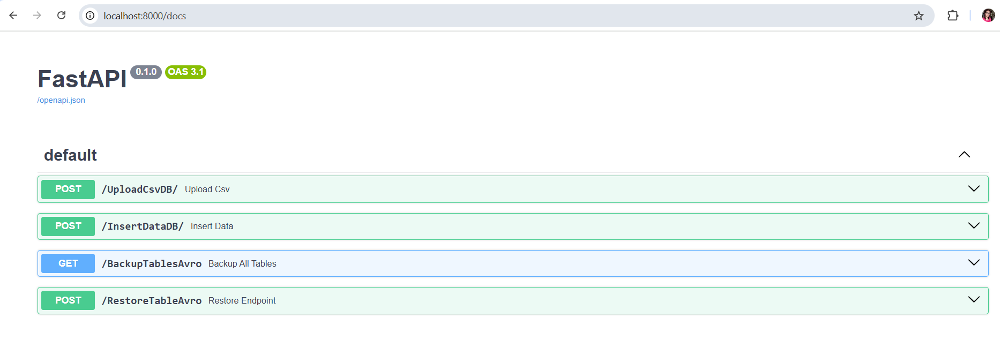
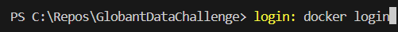

# Globant Data Challenge

## 🚀 Descripción
Para este challenge se usó:  
✅ API REST con FastAPI  
✅ Conexión a SQL Server en Azure  
✅ Validación de datos y registros inválidos  
✅ Soporte para inserciones en lotes (1-1000 filas)  
✅ Backups y restauración en formato AVRO 

## 🛠️ Instalación
1. Clona este repositorio:
   git clone https://github.com/gladisProgramando/GlobantDataChallenge.git

2. Instala las dependencias del proyecto:
pip install -r requirements.txt
El proyecto usa driver odbc, para la conexion con la base de datos sql server en azure, por lo tanto se debe instalar el driver así:

🚀 Uso:
Para ejecutar el servidor fast api:

📡 **Endpoints**:
- **POST /UploadCsvDB/**: Para subir cualquiera de los archivos .csv historicos, en la carpeta Challenge hay una copia de ellos
- **POST /InsertDataDB/** : Para enviar ingreso de datos de las tres tablas mediante un request.
- **GET /BackupTablesAvro/** : Para realizar una copia de las tablas a formato AVRO
- **GET /RestoreTableAvro/**: Para ejecutar un restore de la tabla con base a un archivo AVRO

Desde un explorador, accede a: http://127.0.0.1:8000/docs

Se puede ejecutar por independiente cada api.

🐳 **Docker**:
Si deseas ejecutar el proyecto con Docker:
instala docker en la máquina y realiza lo siguiente pasos.
1. autenticate con tu cuenta, asi:

2. Crea la imagen:

3. Crea y levanta el contenedor:

**Visualización Powewr BI**:
Tablero diseñado en power BI con bookmarks para optimizar el espacio de los filtros de pagina

Desde un explorador, accede a: http://127.0.0.1:8000/docs
